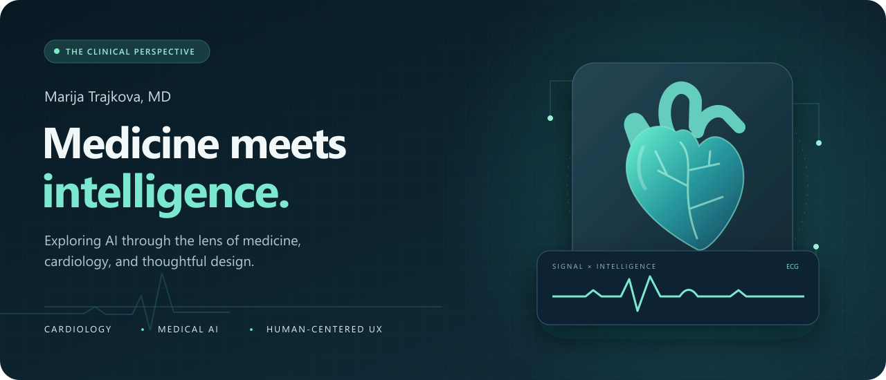
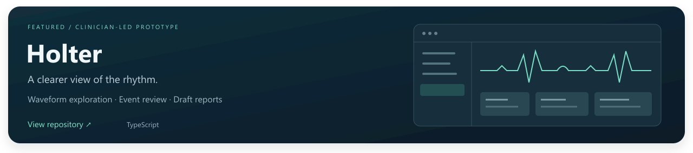

  

  <a href="#about">About</a> &nbsp; &nbsp;
  <a href="#what-im-exploring">Focus</a> &nbsp; &nbsp;
  <a href="#featured-project">Featured project</a> &nbsp; &nbsp;
  <a href="https://github.com/trajkova999-coder?tab=repositories">Repositories </a>

## About

I'm **Marija Trajkova, MD** ” a medical doctor exploring how artificial intelligence and thoughtful software design can support medicine.

My interests sit at the intersection of **cardiology, clinical workflows, and human-centered technology**. I'm especially drawn to tools that make complex medical information easier to navigate, with interfaces that feel clear, calm, and intuitive.

> Clinical questions guide what I build. Clarity guides how I design it.

## What I'm exploring

- **Cardiology & ECG:** heart signals, Holter review, and the way clinicians explore rhythm data.
- **AI in medicine:** biomedical knowledge, evaluation, and useful applications grounded in clinical needs.
- **Clinical UX/UI:** readable waveforms, clear information hierarchy, and workflows that reduce friction.

## Featured project

**[Holter ’](https://github.com/trajkova999-coder/holter)** is a clinician-led ECG review and reporting prototype for healthcare teams, bringing together waveform exploration, event review, and structured draft reports.

*Demonstration only; not for clinical use.*

## Open-source interests

These projects are collected as **forks** on my profile and reflect areas I’m interested in exploring. Credit belongs to their original authors and contributors.

| Project | Area of interest |
| :--- | :--- |
| [BioMedArena](https://github.com/trajkova999-coder/BioMedArena) | Evaluating AI agents on biomedical tasks |
| [CardIO](https://github.com/trajkova999-coder/cardio) | Data science research with heart signals |
| [Cardiobot](https://github.com/trajkova999-coder/cardiobot) | Cardiovascular conversational AI |
| [PrimeKG](https://github.com/trajkova999-coder/PrimeKG) | Knowledge graphs for precision medicine |

---

  <strong>Medicine is the starting point. People are the purpose.</strong> 
  Cardiology Artificial intelligence Thoughtful design

